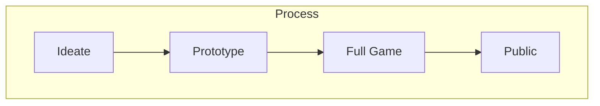
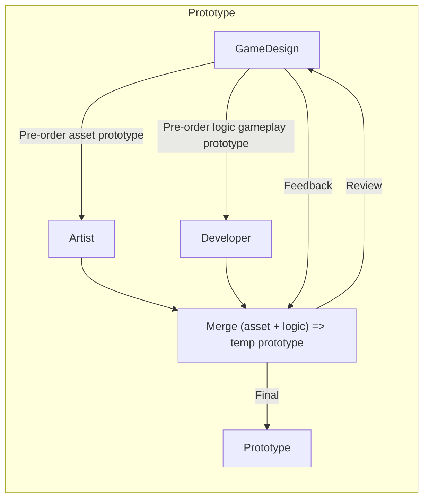

# Mobile Game Production Process

## 1. Ideate (Ý tưởng)
  Đây là phần chủ yếu thuộc về game designer (GD).
- Lên ý tưởng core gameplay trên game design document (GDD).
- Nghiên cứu thị trường xem idea đó có phù hợp để phát triển không (game phù hợp ở thị trường nào, độ tuổi bao nhiêu, doanh thu đến từ đâu,..).

## 2. Prototype

### GameDesign
- Sau khi có GDD chi tiết, GD sẽ yêu cầu dev tìm hiểu và triển khai trước phần logic cốt lõi của game đồng thời order với artist phần asset cơ bản cho gameplay.
### Artist
- Chạy asset cơ bản phần gameplay cho bản prototype.
### Developer
- Sau khi đã tìm hiểu về phần logic chính sẽ sử dụng trong game thì sẽ triển khai code phần gameplay cho bản prototype.
- Nhận asset từ phía artist, lắp ráp vào để có bản prototype ở mức độ chơi được.

Sau khi bản prototype đầu tiên được hoàn thành, GD và các thành viên trong team sẽ review lại và cho nhận xét sau đó đưa ra phương pháp cải thiện (nếu có) cho đến khi bản prototype được hoàn thiện nhất.
  
## 3. Full Game
### GameDesign
- Bổ sung mechanic, sound fx, vfx vào GDD cho game thêm sinh động, cuốn hút hơn.
- Hoàn thiệt phần UI (Giao diện)
- Feeling game (Cải thiệt về điểm chạm, hiệu ứng âm thanh, hiệu ứng rung, hiệu ứng hình ảnh ...)
### Artist
Kết hợp với GD để bổ sung
- Asset InGame
- UI
### Developer (dev)
- Phát triển hoàn thiện game full asset, feeling để sẵn sàng lên chợ.
- Tracking, gán ads, iap.

## 4. Public
- Phát hành game lên GooglePlayStore/ AppStore
