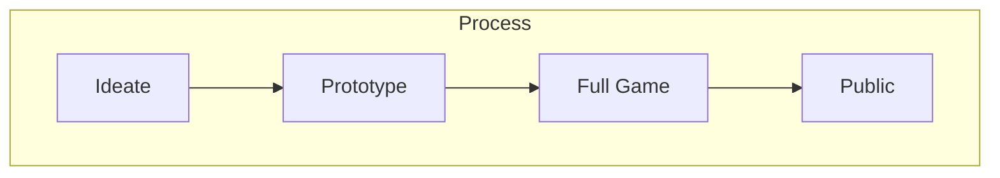
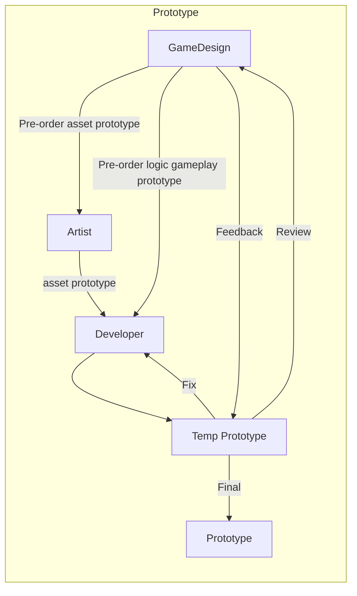

# Mobile Game Production Process

Để làm ra một sản phẩm game thì cần một nhóm nhân sự cơ bản bao gồm:
  -  GameDesign (GD): Nhiệm vụ lên ý tưởng cho game (thường sẽ là leader của dự án game, chịu trách nhiệm chính cho dự án)
  -  Developer (Dev): Nhiệm vụ code game
  -  Artist (Art): Nhiệm vụ vẽ asset cho game

## 1. Ideate (Ý tưởng)
  Đây là phần chủ yếu thuộc về game designer (GD)
- Lên ý tưởng core gameplay trên game design document (GDD).
- Nghiên cứu thị trường xem idea đó có phù hợp để phát triển không (game phù hợp ở thị trường nào, độ tuổi bao nhiêu, doanh thu đến từ đâu,..).

## 2. Prototype

### GameDesign
- Sau khi có GDD chi tiết, GD sẽ yêu cầu Dev tìm hiểu và triển khai trước phần logic cốt lõi của game đồng thời order với Artist phần asset cơ bản cho gameplay.
### Artist
- Chạy asset cơ bản phần gameplay cho bản prototype.
### Developer
- Sau khi đã tìm hiểu về phần logic chính sẽ sử dụng trong game thì sẽ triển khai code phần gameplay cho bản prototype.
- Nhận asset từ phía Artist, lắp ráp vào để có bản prototype ở mức độ chơi được.

Sau khi bản prototype đầu tiên được hoàn thành, GD và các thành viên trong team sẽ review lại và cho nhận xét sau đó đưa ra phương pháp cải thiện (nếu có) cho đến khi bản prototype được hoàn thiện nhất.
  
## 3. Full Game
### GameDesign
- Bổ sung mechanic, sound fx, vfx vào GDD cho game có đầy đủ các tính năng kèm theo các hiệu ứng sinh động.
- Hoàn thiệt phần thiết kế UI (giao diện người dùng), sau đó order phía Artist vẽ asset cho UI.
- Cải thiện feeling game (Cải thiệt về điểm chạm, hiệu ứng âm thanh, hiệu ứng rung, hiệu ứng hình ảnh sao cho đúng và chuẩn vị trí xuất hiện, thời điểm xuất hiện... nhằm mục đích để người chơi cảm nhận được sự thích thú khi chơi game)
### Artist
- Hoàn thiệt các order từ phía GD như asset ingame, ui...
### Developer (Dev)
- Code hoàn thiện tất cả các tính năng trong game và ghép đầy đủ các asset nhận từ phía Artist theo yêu cầu từ phía GD (thường sẽ được ghi đầy đủ trong GDD)

Sau khi Dev hoàn thiện game, sản phẩm lúc này sẽ được gửi đến team Tester. Các bạn Tester sẽ chơi game và đối chiếu với GDD (hoặc trao đổi trực tiếp với GD) để tìm ra những lỗi logic, lỗi ui hoặc tính năng còn thiếu sót, hành động này anh em hay gọi vui là "bới lông tìm vết" hoặc "đào bug" =)). Các lỗi sẽ được liệt kê lại gọi là `Bug List`.
GD sẽ chỉ đạo Dev(nếu lỗi liên quan đến logic) và Artist(nếu lỗi liên quan đến asset) chỉnh sửa và tinh chỉnh cho đến khi clear hết Bug List.

Cuối cùng thì sẽ thu được sản phẩm game đầy đủ các tính năng và cơ bản sạch các lỗi. Sản phẩm này sẽ được chuẩn bị để đưa lên chợ (Public).
Sau khi lên chợ bản đầu tiên thì quá trình bảo trì game, nâng cấp các tính năng vẫn được tiếp tục duy trì nếu sản phẩm game đó có kết quả kinh doanh tốt. Quá trình bảo trì và nâng cấp vẫn sẽ cần tất cả các thành viên triển khai để tạo ra sản phẩm update, test và sửa cho đến khi sản phẩm ổn định nhất mới update sản phẩm lên chợ để thay thế cho sản phẩm trước đó.

### Lưu ý
- Để sản xuất ra game thì vẫn còn một số bộ phận nhân sự khác nữa như Animator (người làm hiệu ứng chuyển động cho nhân vật trong game), Vfx Artist (người làm hiệu ứng hình ảnh, ánh sáng... ), người làm âm thanh cho game (mình không biết gọi là gì), ...
- Làm game mobile với mục đích kinh doanh thì trước khi lên chợ Dev sẽ gắn quảng cáo vào game theo yêu cầu chi tiết của GD, IAP (tính năng mua hàng trong ứng dụng), Tracking (gắn các công cụ theo dõi chỉ số trong game),...

## 4. Public
- Phát hành game lên GooglePlayStore / AppStore
- Lúc này team Marketing sẽ sử dụng chuyên môn thần thành (mình không hiểu rõ về chuyên môn này =)) ) của họ để đưa sản phẩm game đến tay user.
